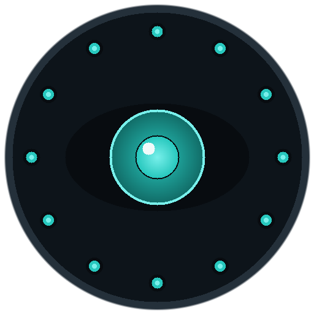

<p align="center">
  
</p>

<h1 align="center">Argus</h1>

<p align="center"><em>The hundred-eyed watchman for your Free Company's submarines and airships.</em></p>

Argus is a [Dalamud](https://github.com/goatcorp/Dalamud) plugin for FINAL FANTASY XIV that tracks every Free Company submarine and airship this client has seen, shows what is out and what is back on the server info bar, works out voyage EXP and rank-ups, suggests routes that respect the vessel's limits, and fills the in-game voyage planner for you. Companion to [Daedalus](https://github.com/ofnature/Daedalus).

## Features

- **Fleet tracker** — all vessels from every FC any of your characters belongs to, with return timers, ranks and builds. Persists locally, so the overview is complete no matter who is logged in.
- **Server info bar** — `Argus: Subs 2/4 · Air 1/2` (returned / total). Turns amber when something is waiting for you. Click to open.
- **EXP calculator** — per-sector EXP with the surveillance / retrieval / favor bonus model, rank-up simulation and voyages-to-rank.
- **Route planner** — best route by EXP per hour or EXP per voyage under a duration cap. Always respects rank, range, ceruleum on hand, unlocked sectors and surveillance requirements. Add **must-include** sectors; **progression** mode automatically includes the next sector that unlocks a sector, map or extra vessel slot, and the planner shows what each sector unlocks.
- **One-click route entry** — with the in-game voyage planner open, an Argus overlay fills in the suggested sectors. You review and press Deploy; Argus never dispatches on its own.
- **Loot history** — items per sector and build, with CSV export.
- **Supplies warnings** — ceruleum tanks and repair kits versus the next dispatch, voyages until repair.
- **Part optimizer** — best part set for a target route or rank within airframe capacity, for submarines and airships.

## Install

In-game: `/xlsettings` → **Experimental** → add to **Custom Plugin Repositories**:

```
https://raw.githubusercontent.com/ofnature/Daedalus/main/repo.json
```

Save, then open `/xlplugins`, search **Argus** and install. (The Daedalus repository URL serves all ofnature companion plugins.)

## Commands

| Command | Action |
|---|---|
| `/argus` | Toggle the main window |
| `/arg` | Short alias |
| `/argus planner` | Jump to the route planner |
| `/argus loot` | Jump to loot history |
| `/argus config` | Open settings |

## Credits

The submarine voyage model is ported from [SubmarineTracker](https://github.com/Infiziert90/SubmarineTracker) by Infi (MIT). See [THIRD-PARTY-NOTICES.txt](THIRD-PARTY-NOTICES.txt).

## License

MIT — see [LICENSE](LICENSE).
